# Gallery

Every picture is rendered from `examples/gallery/scenes.py`; the code under each one is exactly what made it. Re-render with `blender -b --factory-startup -P examples/gallery/render.py` and rebuild with `python3 tools/gallery.py`.

## Cloners

### Linear cloner · Step Curve

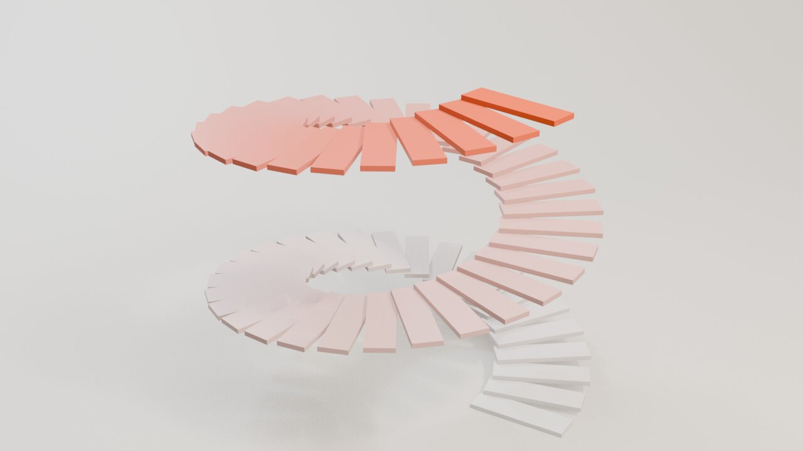

60 slabs, each turned 12° and lifted: Step Curve curls the line into a spiral staircase; a Step effector paints the gradient.

```python
def cloner_linear_spiral():
    slab = cube(1.0, "Slab")
    slab.scale = (1.6, 0.45, 0.08)
    stairs = api.create_cloner("linear", objects=[slab], location=(0, 0, 0), params={
        "Count": 60, "Offset": [0.0, 0.5, 0.09], "Step Curve": [0, 0, 12], "Step Rotation": [0, 0, 12]})
    api.add_effector("step", cloners=[stairs], params={"Color": PALETTE["orange"], "Color Mix": 1.0})
    api.set_color_material([stairs])
    return shoot([stairs], ground="paper", direction=(0.6, -1, 0.55))
```

### Radial cloner · Wave effector


48 columns on a ring; a Wave effector travels around it, lifting and tinting the clones.

```python
def cloner_radial_wave():
    column = cube(1.0, "Column")
    column.scale = (0.18, 0.18, 1.2)
    ring = api.create_cloner("radial", objects=[column], location=(0, 0, 0), params={"Count": 48, "Radius": 4})
    api.add_effector("wave", cloners=[ring], params={
        "Frequency": 2, "Position": [0, 0, 1.4], "Scale": [0, 0, 1.0], "Local Space": False,
        "Color": PALETTE["blue"], "Color Mix": 1.0})
    api.set_color_material([ring])
    return shoot([ring], ground="ink", direction=(0.3, -1, 0.6), lens=45)
```

### Grid cloner · sphere form + Random noise

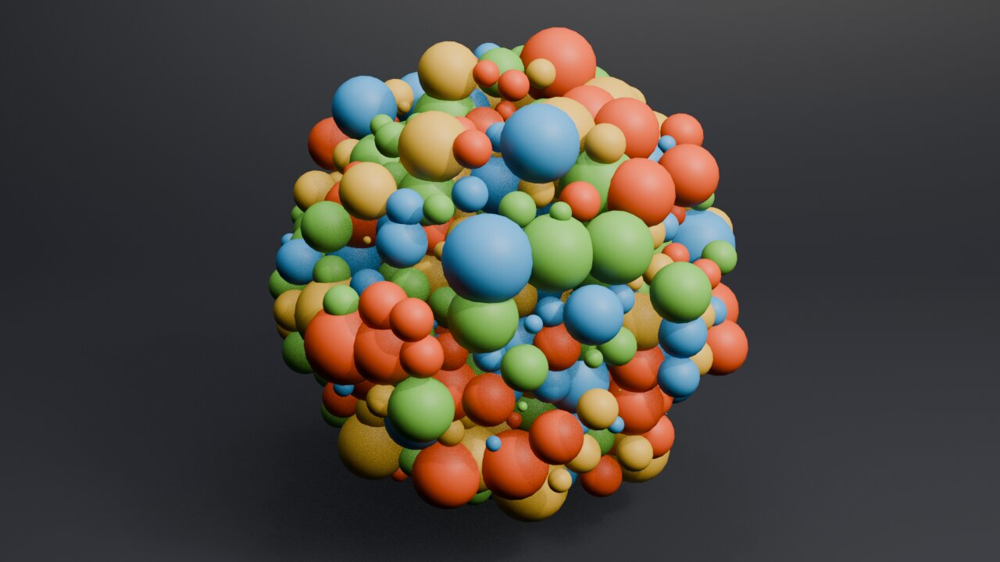

An 11×11×11 grid filled as a sphere; a Random effector in Noise mode scales clones and a Multi shader colors them.

```python
def cloner_grid_sphere():
    ball = sphere(0.3, "Ball", 3)
    grid = api.create_cloner("grid", objects=[ball], location=(0, 0, 0), params={
        "Count X": 11, "Count Y": 11, "Count Z": 11, "Spacing": [0.62, 0.62, 0.62], "Shape": "Sphere"})
    api.add_effector("random", cloners=[grid], params={"Mode": "Noise", "Uniform Scale": 0.9, "Uniform": True,
                                                      "Position": [0.1, 0.1, 0.1]})
    api.multi_material([grid], COLORS[:4], mode="Random")
    return shoot([grid], ground="slate", direction=(0.6, -1, 0.45))
```

### Honeycomb cloner · Shader field

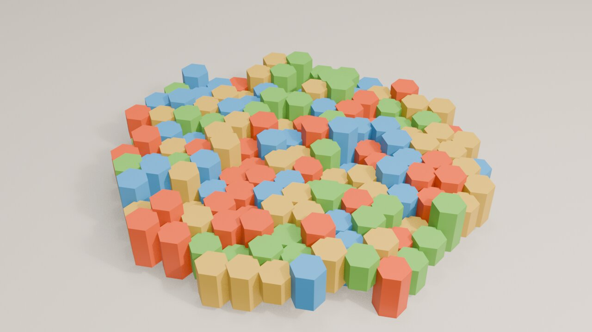

A circular honeycomb of hexagons; a Voronoi Shader field drives a Plain effector's height, and a Multi shader colors each cell.

```python
def cloner_honeycomb():
    bpy.ops.mesh.primitive_cylinder_add(vertices=6, radius=0.45, depth=0.3, rotation=(0, 0, math.pi / 6))
    hexa = bpy.context.object
    comb = api.create_cloner("honeycomb", objects=[hexa], location=(0, 0, 0), params={
        "Count Width": 14, "Count Height": 14, "Size Width": 0.8, "Size Height": 0.7, "Form": "Circle"})
    lift = api.add_effector("plain", cloners=[comb], falloff="Infinite",
                            params={"Position": [0, 0, 0.9], "Scale": [0, 0, 4], "Local Space": False})
    api.add_field("Shader", effectors=[lift], size=1,
                  params={"Texture": "Voronoi", "Texture Scale": 0.55, "Contour": "Ease"})
    api.multi_material([comb], COLORS[:4], mode="Random")
    return shoot([comb], ground="paper", direction=(0.2, -1, 0.85), lens=45)
```

### Object cloner · on a surface

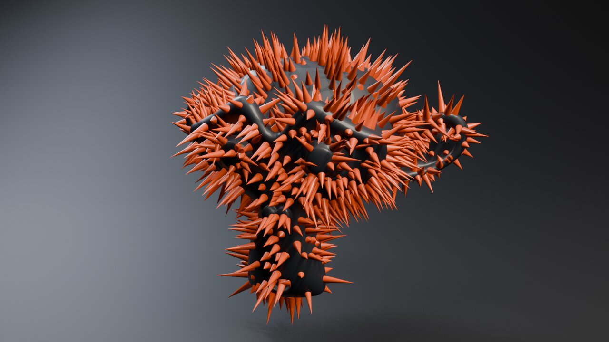

Cones scattered over Suzanne's surface and aligned to its normals; a Random effector varies their length.

```python
def cloner_object():
    bpy.ops.mesh.primitive_monkey_add(size=2)
    monkey = bpy.context.object
    bpy.ops.object.modifier_add(type="SUBSURF")
    bpy.ops.object.shade_smooth()
    paint([monkey], "slate", roughness=0.5)
    bpy.ops.mesh.primitive_cone_add(radius1=0.03, depth=0.16, location=(0, 0, 0.08))
    spike = bpy.context.object
    bpy.ops.object.transform_apply(location=True)
    paint([spike], "orange", roughness=0.3)
    fur = api.create_cloner("object", objects=[spike], location=(0, 0, 0),
                            params={"Object": monkey.name, "Distribution": "Surface", "Count": 1400})
    api.add_effector("random", cloners=[fur], params={"Scale": [0, 0, 0.8], "Uniform Scale": 0.15})
    return shoot([monkey, fur], ground="ink", direction=(0.3, -1, 0.25))
```

### Spline cloner · along a spiral

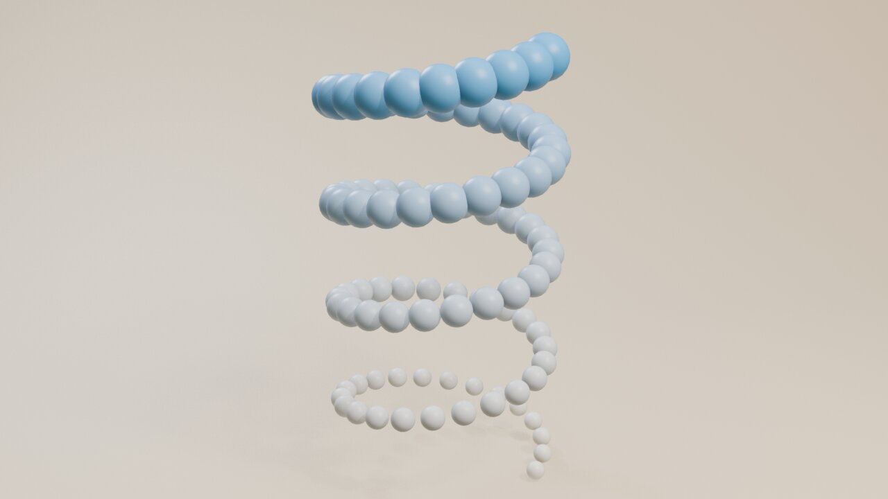

Spheres riding a spiral curve; a Step effector grows them along it and blends the color.

```python
def cloner_spline():
    from moblend import commands
    curve = bpy.data.objects[commands.add_primitive("spiral_curve", size=4)["object"]]
    bead = sphere(0.18, "Bead", 3)
    beads = api.create_cloner("spline", objects=[bead], location=(0, 0, 0),
                              params={"Curve": curve.name, "Count": 90})
    api.add_effector("step", cloners=[beads], params={"Uniform Scale": 1.4, "Color": PALETTE["blue"],
                                                     "Color Mix": 1.0})
    api.set_color_material([beads])
    return shoot([beads], ground="sand", direction=(0.5, -1, 0.35))
```

### Blend clones · morphing

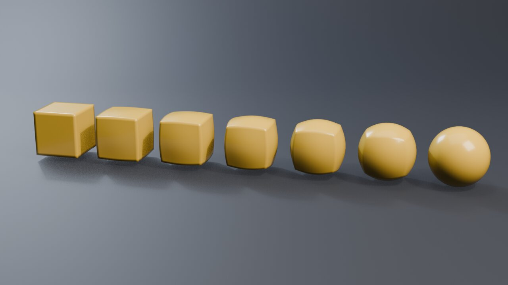

Blend mode morphs clone by clone between two children with the same topology: a cube becomes a sphere along the row.

```python
def cloner_blend():
    bpy.ops.mesh.primitive_cube_add(size=1)
    box = bpy.context.object
    box.name = "A Box"
    bpy.ops.object.modifier_add(type="SUBSURF")
    box.modifiers[-1].subdivision_type = "SIMPLE"  # stays a cube, with enough points to morph into a ball
    box.modifiers[-1].levels = 4
    bpy.ops.object.modifier_apply(modifier=box.modifiers[-1].name)
    ball = box.copy()
    ball.data = box.data.copy()
    ball.name = "B Ball"
    bpy.context.scene.collection.objects.link(ball)
    for v in ball.data.vertices:
        v.co = v.co.normalized() * 0.62
    for o in (box, ball):
        o.data.shade_smooth()
    row = api.create_cloner("linear", objects=[box, ball], location=(0, 0, 0),
                            params={"Count": 7, "Offset": [1.45, 0, 0], "Order": "Blend"})
    paint([row], "yellow", roughness=0.25)
    return shoot([row], ground="slate", direction=(0.25, -1, 0.3), lens=60)
```

### Matrix + Inheritance

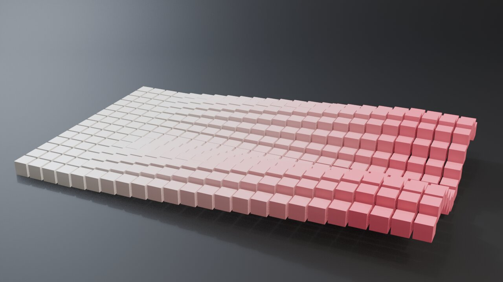

A Matrix (a cloner that renders nothing) carries a Wave effector's motion; a grid of cubes inherits it through a Linear falloff, flat on the left and fully on the wave at the right.

```python
def matrix_inheritance():
    grid = {"Count X": 24, "Count Y": 14, "Count Z": 1, "Spacing": [0.42, 0.42, 1]}
    matrix = api.create_matrix("grid", params=grid)
    api.add_effector("wave", cloners=[matrix], params={"Position": [0, 0, 0.9], "Frequency": 1.5,
                                                      "Local Space": False})
    block = cube(0.36, "Block")
    blocks = api.create_cloner("grid", objects=[block], location=(0, 0, 0), params=grid)
    morph = api.add_effector("inheritance", cloners=[blocks], falloff="Linear", size=3.5,
                             params={"Source": matrix.name})
    tint = api.add_effector("plain", cloners=[blocks], falloff="Linear", size=3.5,
                            params={"Position": [0, 0, 0], "Color": PALETTE["pink"], "Color Mix": 1.0})
    for e in (morph, tint):
        e.rotation_euler.y = math.pi / 2  # the Linear falloff runs along the effector's Z: turn it onto X
    api.set_color_material([blocks])
    return shoot([blocks], ground="ink", direction=(0.45, -1, 0.5), lens=50)
```

## Effectors

### Plain effector · sphere falloff

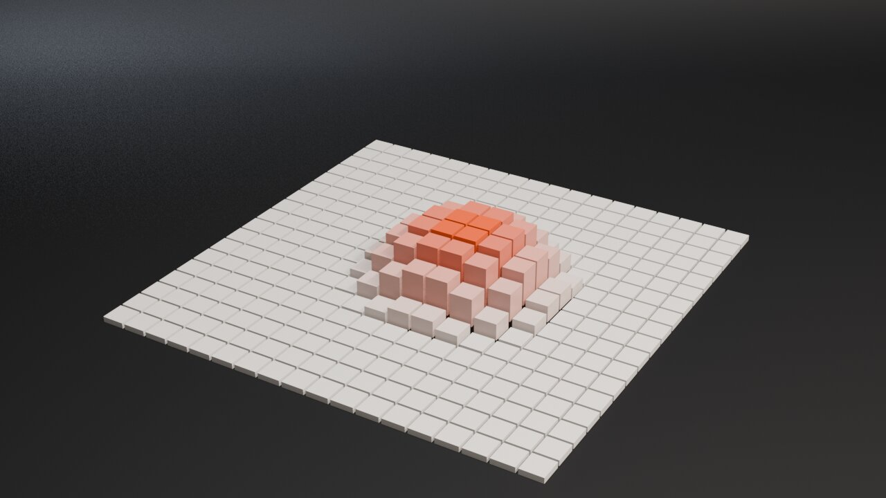

A floor of tiles; a Plain effector's spherical falloff lifts, stretches and paints the ones inside it.

```python
def effector_plain():
    tile = cube(0.9, "Tile")
    tile.scale = (1, 1, 0.25)
    floor = api.create_cloner("grid", objects=[tile], location=(0, 0, 0),
                              params={"Count X": 18, "Count Y": 18, "Count Z": 1, "Spacing": [1, 1, 1]})
    api.add_effector("plain", cloners=[floor], location=(1, 0, 0), size=4.5, params={
        "Position": [0, 0, 1.5], "Scale": [0, 0, 8], "Color": PALETTE["orange"], "Color Mix": 1.0,
        "Local Space": False, "Inner": 0.35})
    api.set_color_material([floor])
    return shoot([floor], ground="ink", direction=(0.6, -1, 0.65), lens=55)
```

### Random effector

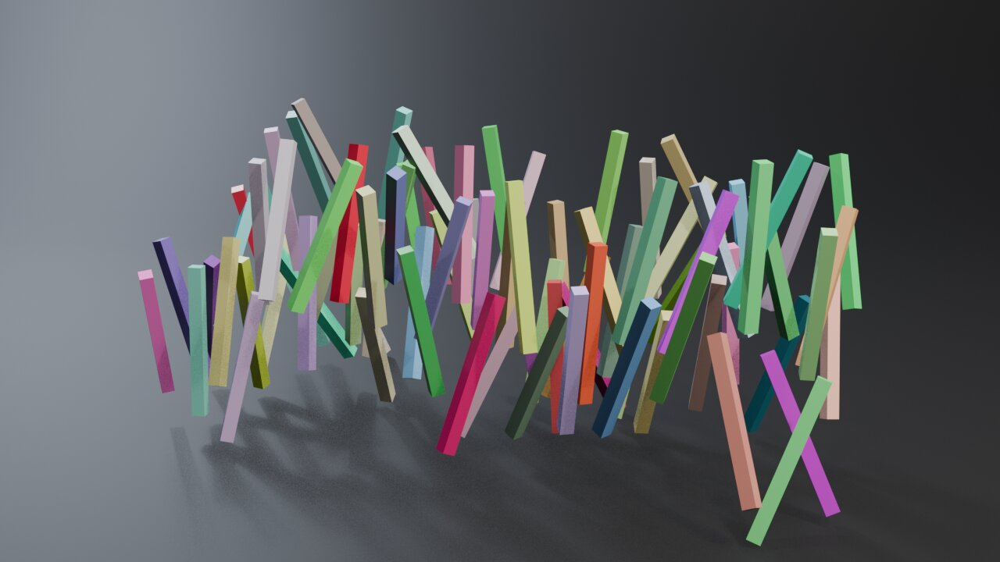

Each clone gets its own random offset, rotation and color.

```python
def effector_random():
    stick = cube(1.0, "Stick")
    stick.scale = (0.12, 0.12, 1.4)
    rows = api.create_cloner("grid", objects=[stick], location=(0, 0, 0),
                             params={"Count X": 14, "Count Y": 6, "Count Z": 1, "Spacing": [0.45, 0.45, 1]})
    api.add_effector("random", cloners=[rows], params={"Rotation": [25, 25, 90], "Position": [0, 0, 0.6],
                                                      "Random Color": True, "Color Mix": 1.0, "Seed": 7})
    api.set_color_material([rows])
    return shoot([rows], ground="ink", direction=(0.4, -1, 0.35))
```

### Step effector

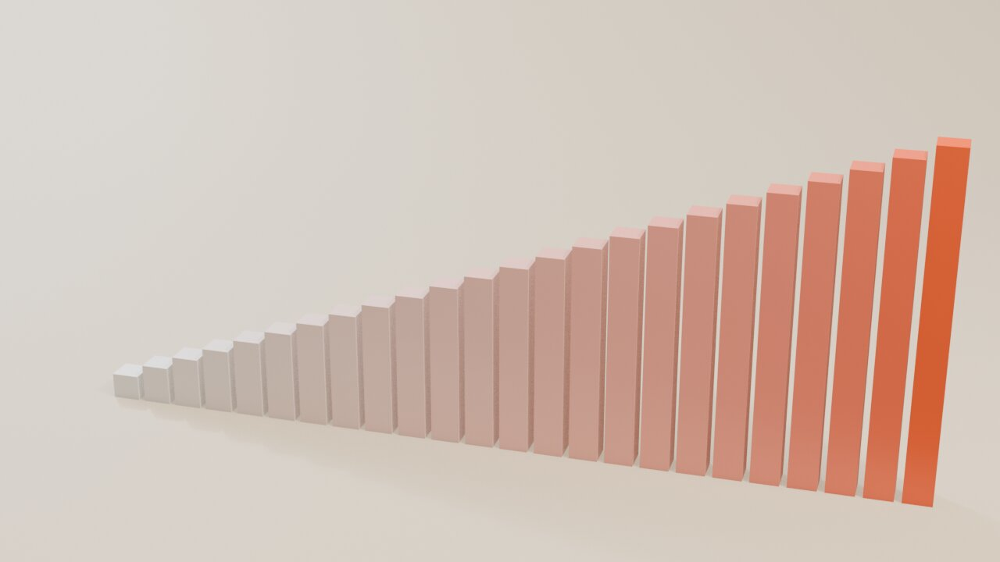

Step ramps the effect across the clone index: each bar a little taller and warmer than the last.

```python
def effector_step():
    bar = cube(1.0, "Bar")
    bar.scale = (0.32, 0.32, 0.3)
    bar.location.z = 0.15
    bpy.ops.object.transform_apply(location=True, scale=False)
    bars = api.create_cloner("linear", objects=[bar], location=(0, 0, 0), params={"Count": 24, "Offset": [0.4, 0, 0]})
    api.add_effector("step", cloners=[bars], params={"Scale": [0, 0, 12], "Color": PALETTE["orange"],
                                                    "Color Mix": 1.0})
    api.set_color_material([bars])
    return shoot([bars], ground="sand", direction=(0.3, -1, 0.4), lens=60)
```

### Formula effector · ripple

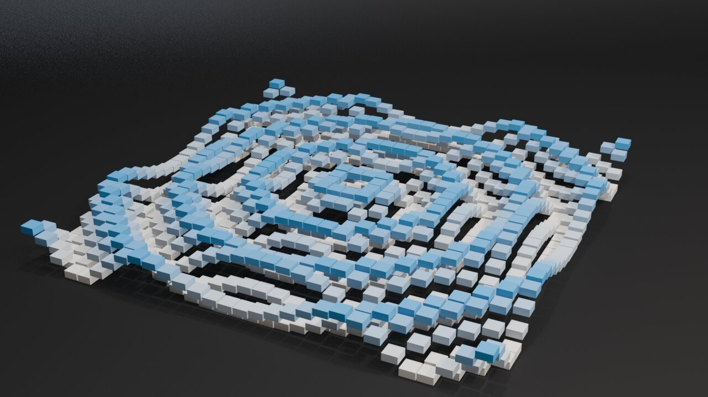

The formula 0.5 + 0.5·sin(3·√(x²+y²) − 4t) lifts each tile: a ripple spreading from the center.

```python
def effector_formula():
    tile = cube(0.42, "Tile")
    tile.scale = (1, 1, 0.5)
    pond = api.create_cloner("grid", objects=[tile], location=(0, 0, 0),
                             params={"Count X": 30, "Count Y": 30, "Count Z": 1, "Spacing": [0.45, 0.45, 1]})
    api.add_effector("formula", cloners=[pond], formula="0.5 + 0.5 * sin(3 * sqrt(x * x + y * y) - 4 * t)",
                     params={"Position": [0, 0, 1.1], "Color": PALETTE["blue"], "Color Mix": 1.0,
                             "Local Space": False})
    api.set_color_material([pond])
    return shoot([pond], ground="ink", direction=(0.5, -1, 0.55), lens=50, frame=6)
```

### Target effector

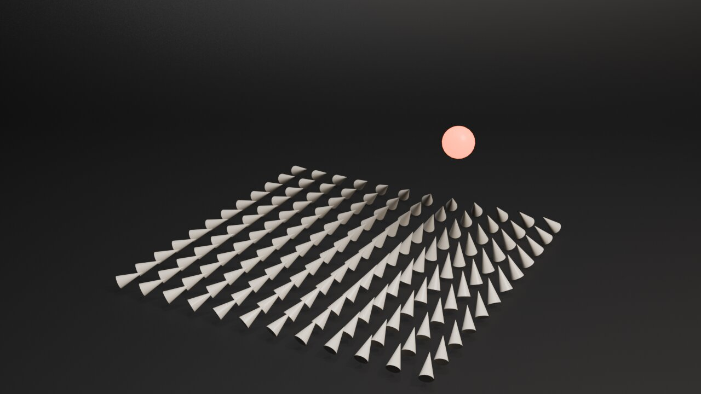

Every clone turns to face the glowing orb.

```python
def effector_target():
    bpy.ops.mesh.primitive_cone_add(radius1=0.18, depth=0.7, location=(0, 0, 0))
    arrow = bpy.context.object
    paint([arrow], "paper", roughness=0.3)
    flock = api.create_cloner("grid", objects=[arrow], location=(0, 0, 0),
                              params={"Count X": 12, "Count Y": 12, "Count Z": 1, "Spacing": [0.8, 0.8, 1]})
    api.add_effector("target", cloners=[flock], location=(2.5, 1.5, 3.2))
    orb = sphere(0.45, "Orb", 3)
    orb.location = (2.5, 1.5, 3.2)
    paint([orb], "orange", emission=6.0)
    return shoot([flock, orb], ground="ink", direction=(0.55, -1, 0.5))
```

### Spline effector

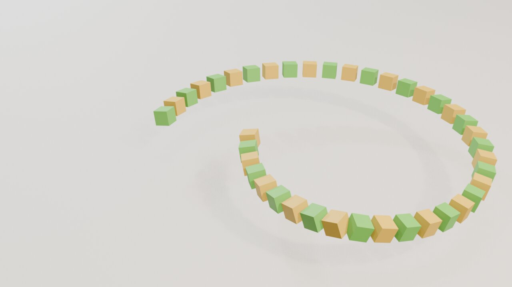

A Spline effector pulls a straight row of cubes onto a circle.

```python
def effector_spline():
    bpy.ops.curve.primitive_bezier_circle_add(radius=3, location=(0, 0, 1.2))
    path = bpy.context.object
    box = cube(0.3, "Box")
    row = api.create_cloner("linear", objects=[box], location=(-6, 0, 0), params={"Count": 40, "Offset": [0.3, 0, 0]})
    api.add_effector("spline", cloners=[row], params={"Curve": path.name, "Loop": True, "End": 0.97,
                                                     "Strength": 0.85})
    api.multi_material([row], [PALETTE["green"], PALETTE["yellow"]], mode="Index")
    return shoot([row], ground="paper", direction=(0.2, -1, 0.7), lens=45)
```

### Push Apart effector

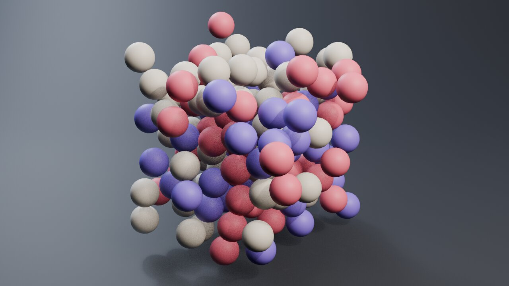

Spheres scattered at random overlap; Push Apart relaxes them until none touch.

```python
def effector_push_apart():
    bpy.ops.mesh.primitive_cube_add(size=3)
    volume = bpy.context.object
    volume.hide_render = True
    volume.display_type = "WIRE"
    ball = sphere(0.25, "Ball", 3)
    swarm = api.create_cloner("object", objects=[ball], location=(0, 0, 0),
                              params={"Object": volume.name, "Distribution": "Volume", "Count": 160})
    api.add_effector("push_apart", cloners=[swarm], params={"Radius": 0.26, "Iterations": 40})
    api.multi_material([swarm], [PALETTE["pink"], PALETTE["paper"], PALETTE["violet"]], mode="Random")
    return shoot([swarm], ground="slate", direction=(0.6, -1, 0.5))
```

### Shader effector

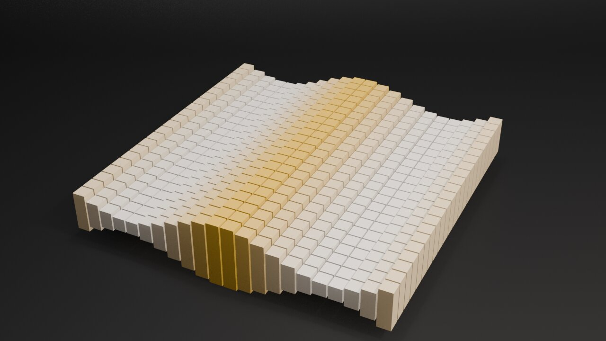

A Wave texture drives the effector: its bands lift the clones and blend their color.

```python
def effector_shader():
    block = cube(0.45, "Block")
    blocks = api.create_cloner("grid", objects=[block], location=(0, 0, 0),
                               params={"Count X": 22, "Count Y": 22, "Count Z": 1, "Spacing": [0.5, 0.5, 1]})
    api.add_effector("shader", cloners=[blocks], params={
        "Texture": "Wave", "Texture Scale": 0.35, "Scale": [0, 0, 4], "Color": PALETTE["yellow"],
        "Color Mix": 1.0, "Local Space": False})
    api.set_color_material([blocks])
    return shoot([blocks], ground="ink", direction=(0.5, -1, 0.7), lens=50)
```

### Sound effector · equalizer

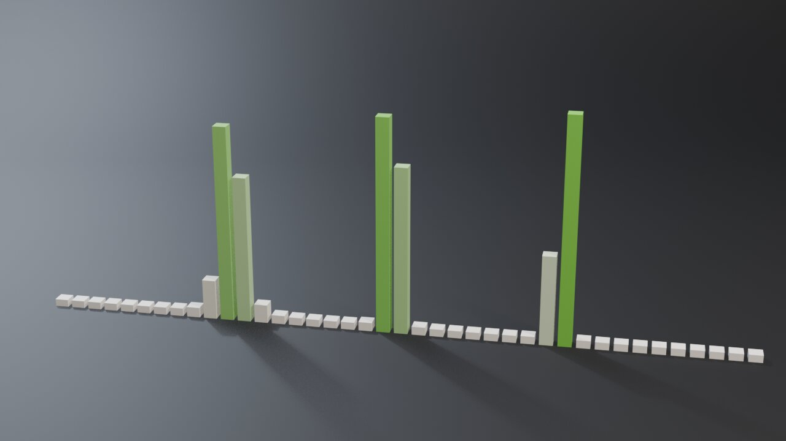

Each bar listens to its own band of a three-note chord (220, 440, 880 Hz): only the bands with sound rise.

```python
def effector_sound():
    import os
    import struct
    import tempfile
    import wave
    path = os.path.join(tempfile.gettempdir(), "moblend_chord.wav")
    rate = 44100
    with wave.open(path, "wb") as w:
        w.setnchannels(1)
        w.setsampwidth(2)
        w.setframerate(rate)
        w.writeframes(b"".join(struct.pack("<h", int(9000 * sum(math.sin(2 * math.pi * f * i / rate)
                                                              for f in (220, 440, 880)))) for i in range(rate * 3)))
    bar = cube(1.0, "Bar")
    bar.scale = (0.18, 0.18, 0.1)
    bar.location.z = 0.05
    bpy.ops.object.transform_apply(location=True, scale=False)
    eq = api.create_cloner("linear", objects=[bar], location=(0, 0, 0), params={"Count": 40, "Offset": [0.24, 0, 0]})
    api.add_effector("sound", cloners=[eq], params={"Sound": path, "Low": 100, "High": 2000, "Gain": 6,
                                                   "Scale": [0, 0, 30], "Color": PALETTE["green"],
                                                   "Color Mix": 1.0})
    paint([eq], "green", emission=1.5)
    api.set_color_material([eq])
    return shoot([eq], ground="ink", direction=(0.2, -1, 0.35), lens=60, frame=20)
```

### Tracer · trails

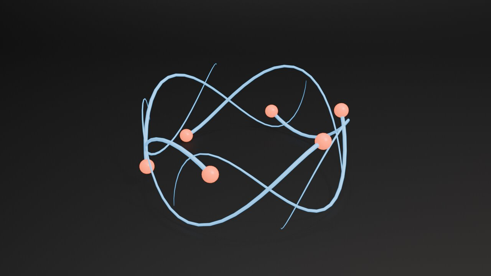

A spinning ring of spheres bobbing on a Wave effector; Tracer trails draw their paths in world space.

```python
def effector_tracer():
    bead = sphere(0.22, "Bead", 3)
    ring = api.create_cloner("radial", objects=[bead], params={"Count": 6, "Radius": 3}, location=(0, 0, 0))
    ring.keyframe_insert("rotation_euler", frame=1)
    ring.rotation_euler.z = 3.0
    ring.keyframe_insert("rotation_euler", frame=40)
    api.add_effector("wave", cloners=[ring], params={"Position": [0, 0, 1.2], "Local Space": False, "Speed": 1.0,
                                                    "Bipolar": True})
    api.add_tracer(ring, {"Mode": "Trails", "Length": 30, "Radius": 0.06})
    paint([ring], "orange", emission=3.0)
    trail = api.solid_material(PALETTE["blue"], emission=2.0, name="Trail")
    api.set_params(ring, {"MB Tracer/Material": trail.name})
    return shoot([ring], ground="ink", direction=(0.2, -1, 0.6), lens=45, frame=30)
```

## Fields

### Layered fields

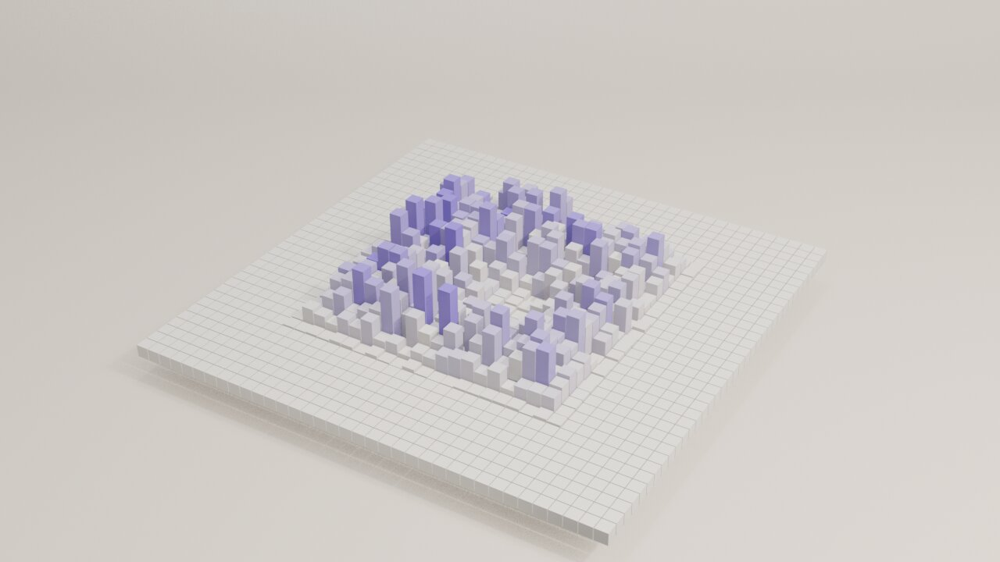

Fields stack like layers: a Box field, minus a Sphere field, times a Noise field — carving a crater into the lifted block.

```python
def fields_layered():
    tile = cube(0.3, "Tile")
    floor = api.create_cloner("grid", objects=[tile], location=(0, 0, 0),
                              params={"Count X": 36, "Count Y": 36, "Count Z": 1, "Spacing": [0.32, 0.32, 1]})
    lift = api.add_effector("plain", cloners=[floor], params={
        "Position": [0, 0, 1.0], "Scale": [0, 0, 6], "Color": PALETTE["violet"], "Color Mix": 1.0,
        "Local Space": False})
    api.add_field("Box", effectors=[lift], size=3.5, params={"Inner": 0.7})
    api.add_field("Sphere", effectors=[lift], size=2.2, location=(0.8, -0.6, 0), blend="Subtract")
    api.add_field("Noise", effectors=[lift], size=3.0, blend="Multiply", params={"Noise Scale": 2.0})
    api.set_color_material([floor])
    return shoot([floor], ground="paper", direction=(0.6, -1, 0.75), lens=50)
```

## Fracture

### Voronoi Fracture · detailed

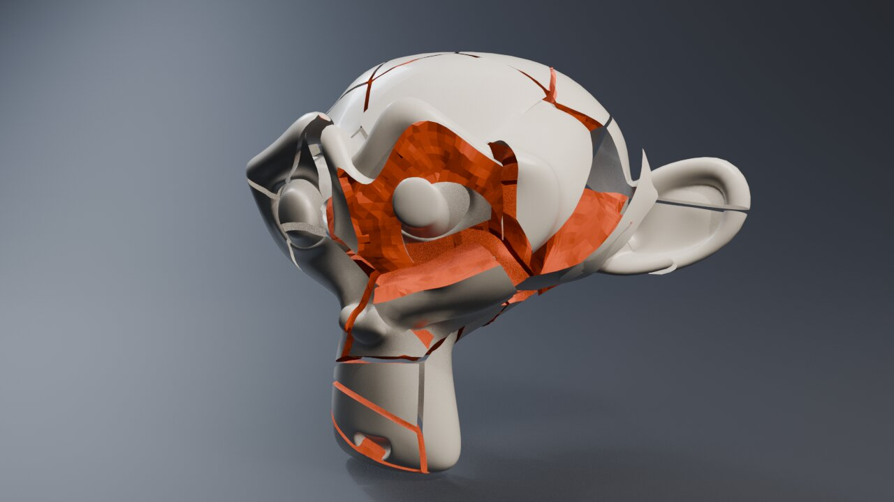

Suzanne cut into 40 pieces with noise-detailed cut faces in their own material; a Random effector loosens the pieces near one cheek.

```python
def voronoi():
    bpy.ops.mesh.primitive_monkey_add(size=3)
    monkey = bpy.context.object
    bpy.ops.object.modifier_add(type="SUBSURF")
    monkey.modifiers[-1].levels = 2
    bpy.ops.object.modifier_apply(modifier=monkey.modifiers[-1].name)
    bpy.ops.object.shade_smooth()
    api.voronoi_fracture(monkey, pieces=40, seed=4, offset=0.02, detail=True, max_edge=0.08,
                         noise_strength=0.03, noise_scale=3.0, colorize=False)
    two_tone(monkey, "paper", "orange")
    api.add_effector("random", cloners=[monkey], location=(1.3, -1.0, 0.4), size=1.8, falloff="Sphere",
                     params={"Position": [0.3, 0.3, 0.3], "Rotation": [15, 15, 15], "Seed": 2})
    return shoot([monkey], ground="slate", direction=(0.6, -1, 0.25))
```

### Voronoi Fracture · hollow shell

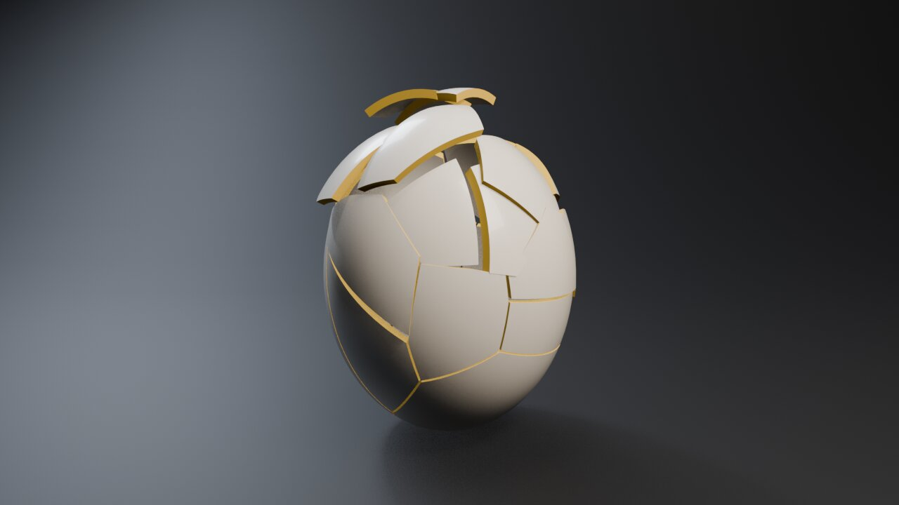

Hull Only fractures just a shell; the pieces of a broken egg drift apart while the cut faces keep their thickness.

```python
def voronoi_shell():
    egg = sphere(1.2, "Egg", 5)
    egg.scale.z = 1.3
    bpy.ops.object.transform_apply(location=False, rotation=False, scale=True)
    api.voronoi_fracture(egg, pieces=24, seed=2, hull_only=True, thickness=0.08, offset=0.01, colorize=False)
    two_tone(egg, "paper", "yellow")
    api.add_effector("random", cloners=[egg], location=(0, 0, 1.2), size=1.6, falloff="Sphere",
                     params={"Position": [0.25, 0.25, 0.4], "Rotation": [25, 25, 25], "Seed": 3})
    return shoot([egg], ground="ink", direction=(0.5, -1, 0.35))
```

### PolyFX · polygons as clones

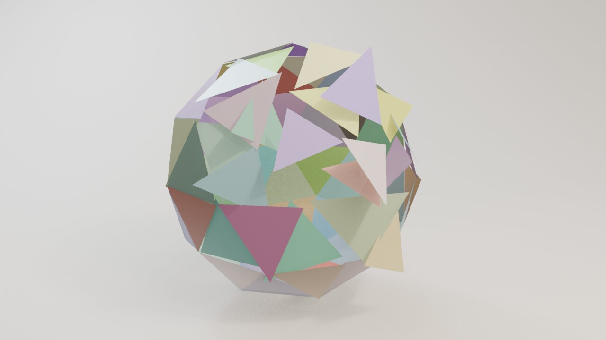

Fracture in Polygons mode makes every face a clone; a Random effector scatters the faces of a sphere.

```python
def polyfx():
    ball = sphere(1.5, "Ball", 2)
    bpy.ops.object.shade_flat()
    api.add_fracture(ball, "Polygons")
    api.set_params(ball, {"MB Fracture/Colorize": True})
    api.set_color_material([ball])
    api.add_effector("random", cloners=[ball], location=(1.5, -1.2, 0.8), size=2.5, falloff="Sphere",
                     params={"Position": [0.4, 0.4, 0.4], "Rotation": [60, 60, 60], "Uniform Scale": -0.3})
    return shoot([ball], ground="paper", direction=(0.6, -1, 0.3))
```

## Generators

### MoText

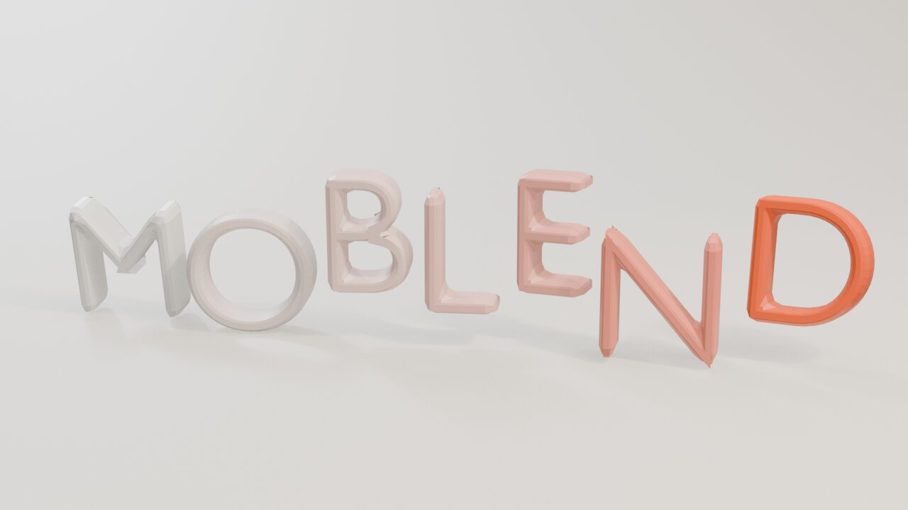

Bevelled 3D text split into letters; Random rotates them and Step colors them.

```python
def motext():
    text = api.create_motext("MOBLEND", location=(0, 0, 0), params={"Size": 1.6, "Depth": 0.45, "Bevel": 0.03})
    api.add_effector("random", cloners=[text], params={"Rotation": [10, 0, 14], "Position": [0, 0.2, 0.25],
                                                      "Seed": 5})
    api.add_effector("step", cloners=[text], params={"Color": PALETTE["orange"], "Color Mix": 1.0})
    return shoot([text], ground="paper", direction=(0.25, -1, 0.25), lens=60)
```

### MoSpline · Simple and Turtle

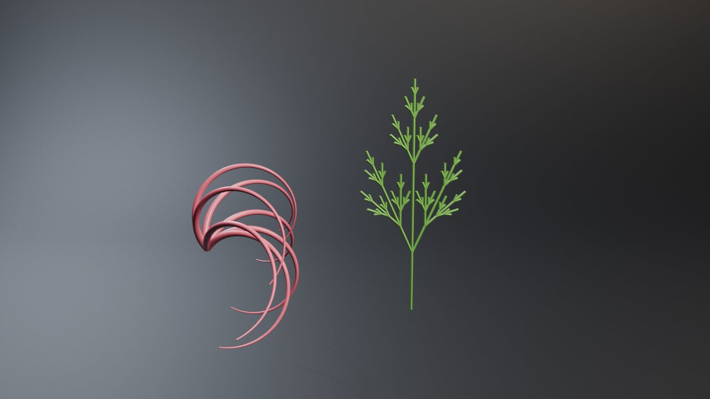

Left: a Simple MoSpline flower (7 curled segments made into tubes). Right: an L-system tree drawn by the Turtle.

```python
def mospline():
    flower = api.create_mospline("Simple", location=(-1.8, 0, 0), params={
        "Segments": 7, "Steps": 140, "Length": 4.2, "Angle": [0, 260, 0], "Spread": 40, "Width": 0.07,
        "End Width": 0.15})
    paint([flower], "pink", roughness=0.3)
    tree = api.create_mospline_turtle(premise="X", rules="X=F[+X][-X]FX, F=FF", iterations=5, angle=24, step=0.07,
                                      location=(2.0, 0, -1.2))
    tree.rotation_euler.z = math.pi / 2  # the Turtle draws in the YZ plane: face it to the camera
    tree.data.bevel_depth = 0.02
    paint([tree], "green", roughness=0.5)
    return shoot([flower, tree], ground="ink", direction=(0.0, -1, 0.25), lens=45)
```

### Sweep · growth

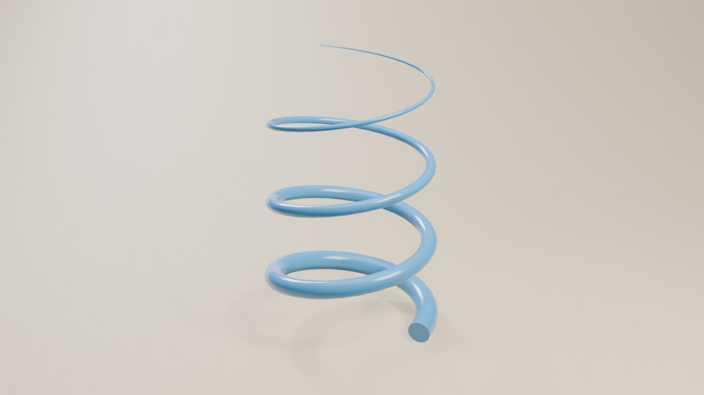

A profile swept along a spiral path, tapering to a point; animate End to grow it.

```python
def sweep():
    from moblend import commands
    path = bpy.data.objects[commands.add_primitive("spiral_curve", size=3)["object"]]
    ribbon = api.create_sweep(path, params={"Radius": 0.22, "Sides": 24, "End": 0.85, "End Scale": 0.05,
                                            "Twist": 720})
    paint([ribbon], "blue", roughness=0.2, coat=0.6)
    return shoot([ribbon], ground="sand", direction=(0.6, -1, 0.4))
```

### Loft

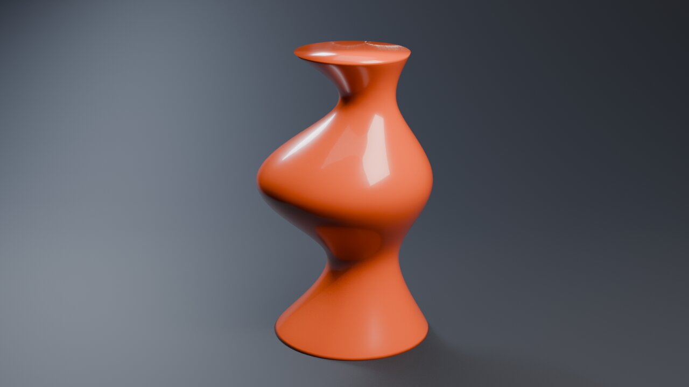

A smooth surface skinned through five profile circles of different sizes, with caps.

```python
def loft():
    profiles = []
    for z, r, dx in ((0, 1.0, 0.0), (1.0, 0.45, 0.15), (2.0, 1.1, -0.1), (3.0, 0.35, 0.2), (3.6, 0.7, 0.0)):
        bpy.ops.curve.primitive_bezier_circle_add(radius=r, location=(dx, 0, z))
        profiles.append(bpy.context.object)
    vase = api.create_loft(profiles, params={"Points": 64, "Rows": 96})
    paint([vase], "orange", roughness=0.25, coat=0.5)
    return shoot([vase], ground="slate", direction=(0.4, -1, 0.35), lens=60)
```

### Volume Builder

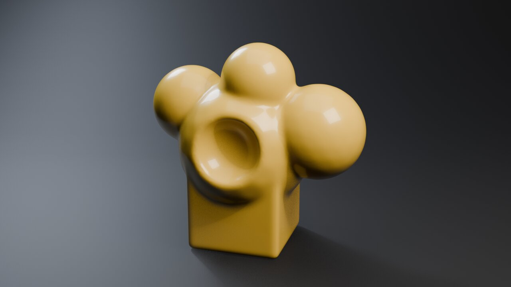

Spheres and a box merged into one smooth mesh, with a sphere carved out.

```python
def volume_builder():
    parts = []
    for loc, r in (((0, 0, 0), 1.0), ((1.1, 0, 0.3), 0.7), ((-0.9, 0.2, 0.5), 0.6), ((0.2, 0, 1.0), 0.55)):
        parts.append(sphere(r, "Blob", 3))
        parts[-1].location = loc
    blob_cube = cube(1.4, "Base")
    blob_cube.location = (0, 0, -0.8)
    hole = sphere(0.5, "Hole", 3)
    hole.location = (0, -1.0, 0.2)
    blob = api.create_volume_builder(add=parts + [blob_cube], subtract=[hole],
                                     params={"Voxel Size": 0.025, "Smooth": 6})
    paint([blob], "yellow", roughness=0.3, coat=0.4)
    return shoot([blob], ground="ink", direction=(0.3, -1, 0.35), lens=60)
```

### Spline Mask

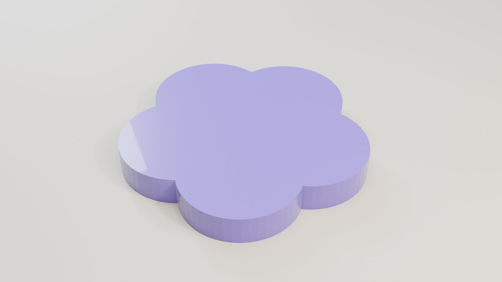

Five circles in a ring and one in the middle, combined into one outline (Union), filled, then extruded.

```python
def spline_mask():
    circles = []
    for k in range(5):
        a = k * 2 * math.pi / 5
        bpy.ops.curve.primitive_bezier_circle_add(radius=1.0, location=(math.cos(a) * 1.1, math.sin(a) * 1.1, 0))
        circles.append(bpy.context.object)
    bpy.ops.curve.primitive_bezier_circle_add(radius=0.7)
    circles.append(bpy.context.object)
    mask = api.create_spline_mask(circles, mode="Union", output="Fill")
    api.add_extrude(mask, depth=0.5)
    paint([mask], "violet", roughness=0.3, coat=0.5)
    return shoot([mask], ground="paper", direction=(0.4, -1, 0.9), lens=50)
```

### MoExtrude

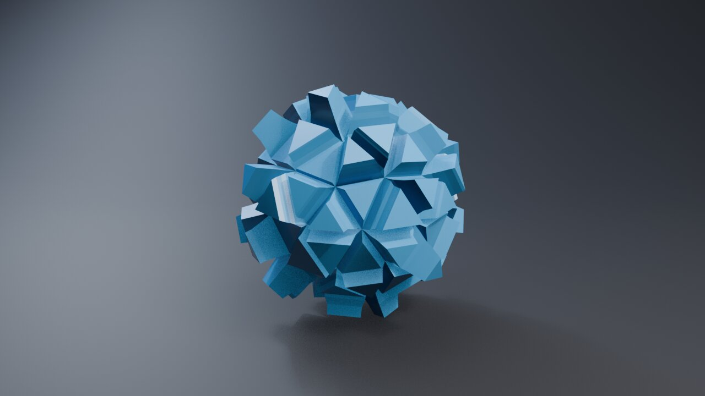

Every face of a sphere extruded in four steps, scaled down each step, with a Noise field varying the extrusion per face.

```python
def moextrude():
    ball = sphere(1.0, "Ball", 2)
    bpy.ops.object.shade_flat()
    ext = api.add_deformer("moextrude", targets=[ball], params={"Steps": 4, "Offset": 0.18, "Scale": 0.82})
    api.add_field("Noise", effectors=[ext], size=1.5, params={"Noise Scale": 1.5})
    paint([ball], "blue", roughness=0.35)
    return shoot([ball], ground="slate", direction=(0.6, -1, 0.4))
```

### MoInstance

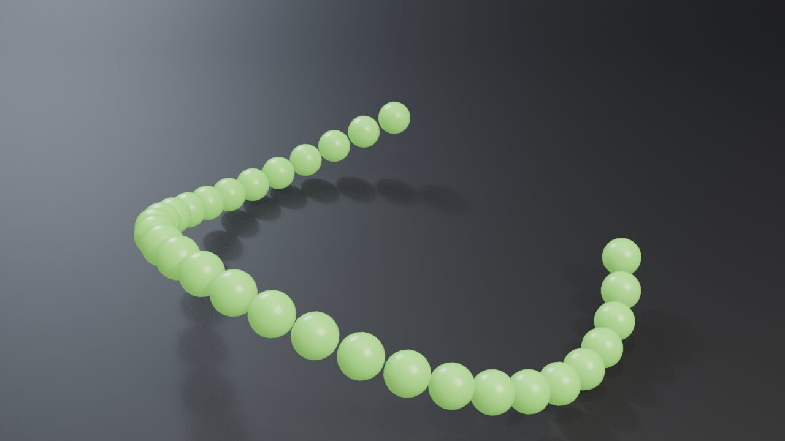

A sphere flies along a path, leaving a trail of its own copies behind.

```python
def moinstance():
    seed_obj = sphere(0.25, "Seed", 3)
    seed_obj.location = (0, 30, 0)
    paint([seed_obj], "green", emission=1.0)
    trail = api.create_moinstance(seed_obj, location=(0, 0, 0), params={"History Depth": 30})
    scene_ = bpy.context.scene
    for f in range(1, 41):
        trail.location = (math.cos(f * 0.16) * 3, math.sin(f * 0.16) * 3, math.sin(f * 0.3) * 0.8)
        trail.keyframe_insert("location", frame=f)
    scene_.frame_start = 1
    return shoot([trail], ground="ink", direction=(0.2, -1, 0.7), lens=45, frame=40)
```

## Deformers

### Deformers · Twist + Wave

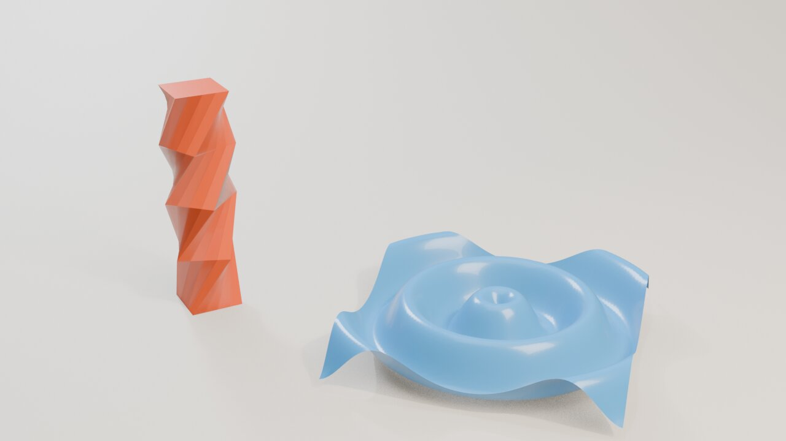

Left: a column twisted 270° by a Twist deformer. Right: a Wave deformer rippling a plane.

```python
def deformers():
    bpy.ops.mesh.primitive_cube_add(size=1, location=(-2.2, 0, 1.5))
    column = bpy.context.object
    column.scale = (0.7, 0.7, 3)
    bpy.ops.object.transform_apply(location=False, rotation=False, scale=True)
    bpy.ops.object.modifier_add(type="SUBSURF")
    column.modifiers[-1].subdivision_type = "SIMPLE"
    column.modifiers[-1].levels = 5
    api.add_deformer("twist", targets=[column], params={"Angle": 270})
    paint([column], "orange", roughness=0.3)
    bpy.ops.mesh.primitive_grid_add(x_subdivisions=80, y_subdivisions=80, size=3.5, location=(1.8, 0, 0.4))
    plane = bpy.context.object
    bpy.ops.object.shade_smooth()
    api.add_deformer("wave", targets=[plane], params={"Amplitude": 0.25, "Wavelength": 0.9, "Radial": True})
    paint([plane], "blue", roughness=0.25)
    return shoot([column, plane], ground="paper", direction=(0.3, -1, 0.45))
```

## Shaders

### Multi + Beat shaders

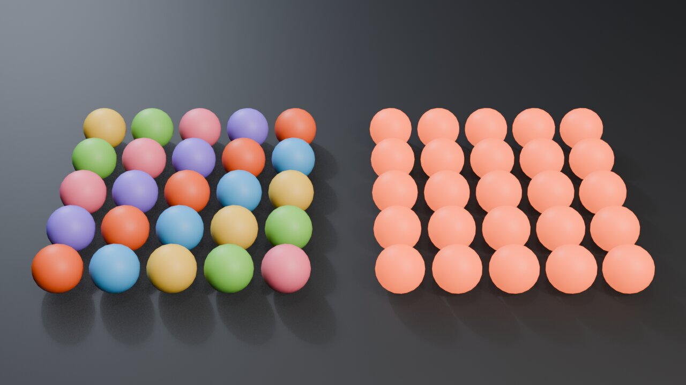

Multi colors clones by index; Beat pulses color and glow on the beat (here 120 BPM, caught on a peak).

```python
def shaders():
    cell = sphere(0.35, "Cell", 3)
    left = api.create_cloner("grid", objects=[cell], location=(-2.4, 0, 0),
                             params={"Count X": 5, "Count Y": 5, "Count Z": 1, "Spacing": [0.8, 0.8, 1]})
    api.multi_material([left], COLORS, mode="Index")
    beat_cell = sphere(0.35, "Beat Cell", 3)
    right = api.create_cloner("grid", objects=[beat_cell], location=(2.4, 0, 0),
                              params={"Count X": 5, "Count Y": 5, "Count Z": 1, "Spacing": [0.8, 0.8, 1]})
    api.beat_material([right], bpm=120, color=PALETTE["orange"], base=PALETTE["slate"], emission=2.0)
    return shoot([left, right], ground="ink", direction=(0.0, -1, 0.9), lens=45, frame=3)
```
